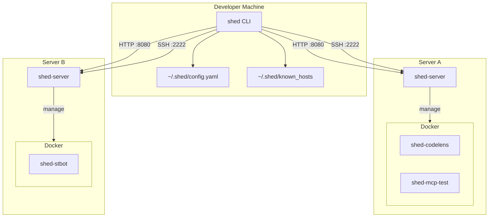
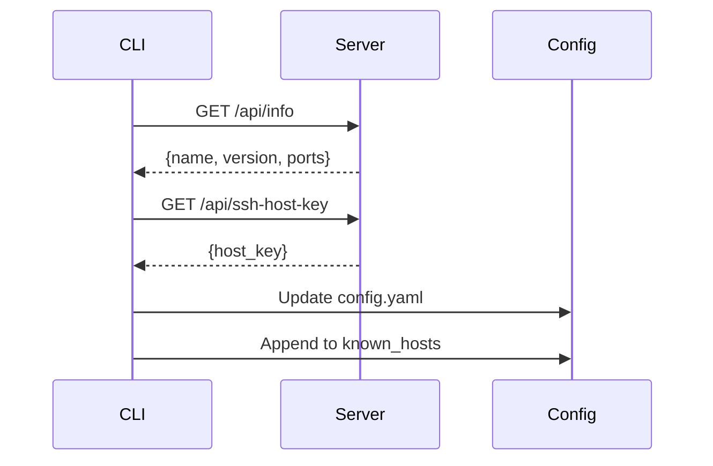
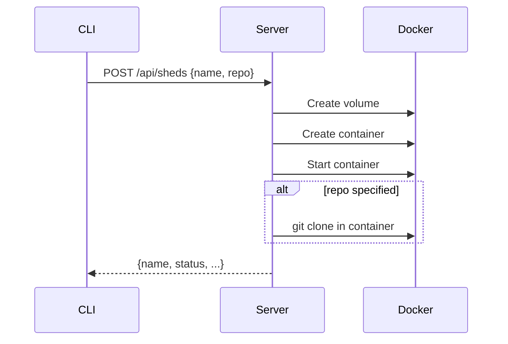
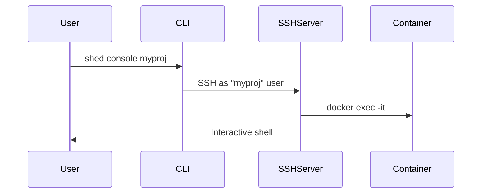
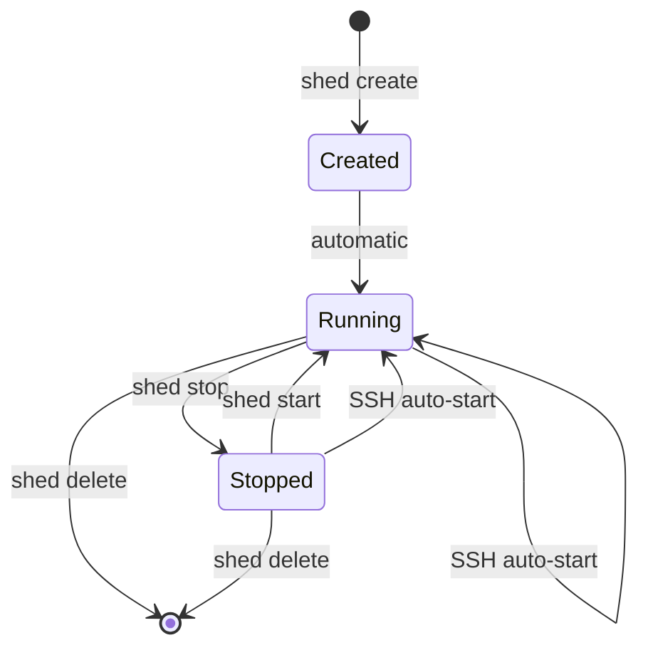

# Architecture

This document describes Shed's internal architecture and design decisions.

## System Overview



## Components

| Component | Description |
|-----------|-------------|
| `shed` | CLI binary for developer machines (macOS, Linux) |
| `shed-server` | Server binary exposing HTTP + SSH APIs (Linux) |
| `shed-agent` | Agent binary running inside Firecracker VMs (Linux) |
| `shed-base` | Docker image with pre-installed dev tools |

## Communication Protocols

| Protocol | Port | Purpose |
|----------|------|---------|
| HTTP | 8080 | REST API for CRUD operations, server discovery |
| SSH | 2222 | Terminal access, IDE remote connections |

## Naming Conventions

| Resource | Format | Example |
|----------|--------|---------|
| Container | `shed-{name}` | `shed-codelens` |
| Volume | `shed-{name}-workspace` | `shed-codelens-workspace` |
| SSH Host | `shed-{name}` | `shed-codelens` (in SSH config) |

## Docker Labels

All shed-managed containers are tagged:

```
shed=true
shed.name={name}
shed.created={ISO8601 timestamp}
shed.repo={owner/repo}
```

## Data Flows

### Server Discovery



### Shed Creation



### SSH Connection



## Internal Packages

### `internal/api`

HTTP API handlers and routing. Uses standard `net/http` with Chi router.

### `internal/config`

Configuration types and loading for both client and server configs.

### `internal/docker`

Docker client wrapper for container and volume operations.

### `internal/sshd`

SSH server implementation using `gliderlabs/ssh`. Routes connections to containers based on username.

### `internal/sshconfig`

Parses and generates SSH config files. Manages the shed-specific block in `~/.ssh/config`.

### `internal/firecracker`

Firecracker backend: VM lifecycle, vsock communication, TAP networking, rootfs management, metadata persistence, and credential transfer.

### `internal/agentproto`

Binary protocol for framed messages over vsock between shed-server and shed-agent.

### `internal/backend`

Backend interface that Docker and Firecracker backends both implement.

### `internal/provision`

Handles in-repo provisioning hooks (`.shed/provision.yaml`).

### `internal/sync`

Client-side file synchronization to containers.

### `internal/tunnels`

SSH tunnel management for port forwarding.

## Security Model

Shed relies on network-level trust:

- Assumes all machines are on a private network (Tailscale)
- No authentication on HTTP API
- SSH accepts all keys (network access = trust)
- Not suitable for multi-tenant or public deployments

## Container Lifecycle



## File Locations

### Client

| Path | Purpose |
|------|---------|
| `~/.shed/config.yaml` | Server list, defaults, cached sheds |
| `~/.shed/known_hosts` | SSH host keys |
| `~/.shed/sync.yaml` | File sync configuration |
| `~/.shed/tunnels.yaml` | Tunnel profiles |

### Server

| Path | Purpose |
|------|---------|
| `/etc/shed/server.yaml` | Server configuration |
| `/etc/shed/host_key` | SSH host private key |
| `~/.shed/env` | Environment variables for containers |
