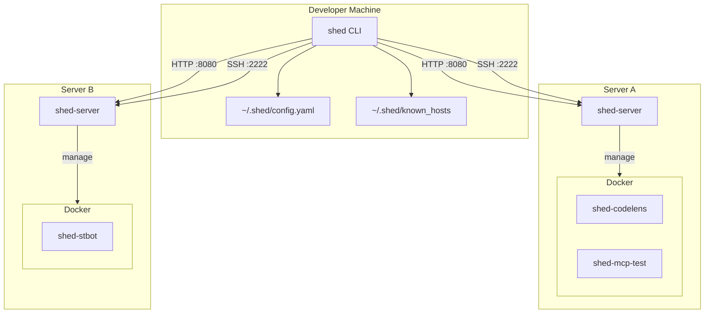
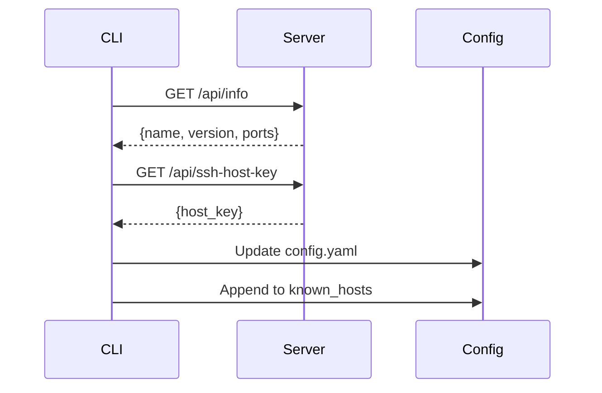
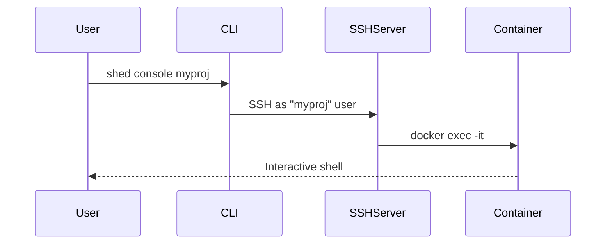
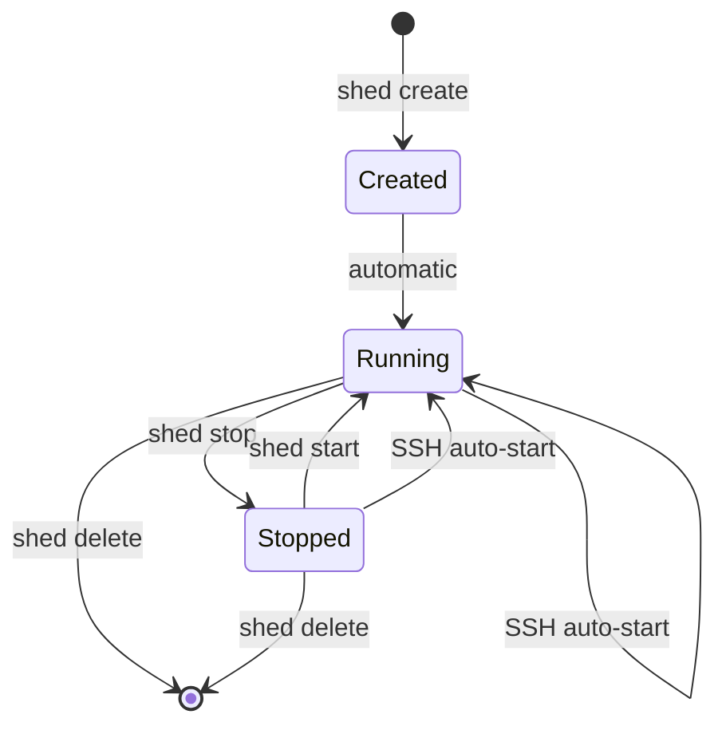

# Architecture

This document describes Shed's internal architecture and design decisions.

## System Overview



## Components

| Component | Description |
|-----------|-------------|
| `shed` | CLI binary for developer machines (macOS, Linux) |
| `shed-server` | Server binary exposing HTTP + SSH APIs (Linux, macOS) |
| `shed-agent` | Agent binary running inside Firecracker and VZ VMs (Linux) |
| `shed-base` | Docker image with pre-installed dev tools |

## Communication Protocols

| Protocol | Port | Purpose |
|----------|------|---------|
| HTTP | 8080 | REST API for CRUD operations, server discovery |
| SSH | 2222 | Terminal access, IDE remote connections |
| vsock | 1024 | VM console I/O (Firecracker, VZ) |
| vsock | 1026 | Message bus — health checks, plugins, credential sync (Firecracker, VZ) |

## Naming Conventions

| Resource | Format | Example |
|----------|--------|---------|
| Container | `shed-{name}` | `shed-codelens` |
| Volume | `shed-{name}-workspace` | `shed-codelens-workspace` |
| SSH Host | `shed-{name}` | `shed-codelens` (in SSH config) |

## Docker Labels

All shed-managed containers are tagged:

```
shed=true
shed.name={name}
shed.created={ISO8601 timestamp}
shed.repo={owner/repo}
shed.backend={docker|firecracker|vz}
shed.local_dir={host path}
```

## Data Flows

### Server Discovery



### Shed Creation

For the user-facing lifecycle documentation (what happens at each step across all backends), see [Provisioning: Shed Lifecycle](../reference/provisioning.md#shed-lifecycle).

The diagrams below show the internal implementation flow for each backend.

=== "Docker"

    ```mermaid
    sequenceDiagram
        participant CLI
        participant Server
        participant Docker

        CLI->>Server: POST /api/sheds {name, repo, local_dir}
        alt local_dir specified
            Server->>Docker: Create container (bind mount + credential bind mounts)
        else
            Server->>Docker: Create volume
            Server->>Docker: Create container (volume + credential bind mounts)
        end
        Server->>Docker: Start container
        Server->>Docker: Fix workspace ownership (chown)
        alt repo specified
            Server->>Docker: git clone via docker exec
        end
        Server->>Docker: Run install hook via docker exec
        Server->>Docker: Capture PATH → /etc/profile.d/
        Server->>Docker: Run startup hook via docker exec
        Server-->>CLI: {name, status, ...}
        CLI->>CLI: Auto-sync default profile via SSH+tar
    ```

=== "Firecracker"

    ```mermaid
    sequenceDiagram
        participant CLI
        participant Server
        participant VM as Firecracker VM
        participant Agent as shed-agent

        CLI->>Server: POST /api/sheds {name, repo, local_dir}
        Server->>Server: Copy base rootfs to instance dir
        Server->>Server: Allocate CID, TAP device, IP address
        Server->>Server: Classify credentials (9P vs tar)
        Server->>VM: Spawn Firecracker process
        Server->>Agent: Wait for agent health (poll vsock:1026)
        Agent-->>Server: Healthy
        alt local-dir specified
            Server->>Server: Start 9P TCP server on bridge IP
            Server->>Agent: Mount 9P share at /workspace
        end
        Server->>Agent: Mount 9P credential directories
        Server->>Agent: Transfer file credentials via tar-over-vsock
        alt repo specified
            Server->>Agent: git clone via vsock exec
        end
        Server->>Agent: Run install hook via vsock exec
        Server->>Agent: Capture PATH → /etc/profile.d/
        Server->>Agent: Run startup hook via vsock exec
        Server-->>CLI: {name, status, ...}
        CLI->>CLI: Auto-sync default profile via SSH+tar
    ```

=== "VZ"

    ```mermaid
    sequenceDiagram
        participant CLI
        participant Server
        participant vfkit
        participant Agent as shed-agent

        CLI->>Server: POST /api/sheds {name, repo, local_dir}
        Server->>Server: Copy base rootfs to instance dir
        Server->>Server: Classify credentials (VirtioFS vs tar)
        Server->>vfkit: Spawn vfkit with VirtioFS devices
        Note right of vfkit: Devices: rootfs, local-dir share,<br/>credential directory shares
        Server->>Agent: Wait for agent health (poll vsock:1026)
        Agent-->>Server: Healthy
        alt local-dir specified
            Server->>Agent: Mount VirtioFS share at /workspace
        end
        Server->>Agent: Mount VirtioFS credential directories
        Server->>Agent: Transfer file credentials via tar-over-vsock
        alt repo specified
            Server->>Agent: git clone via vsock exec
        end
        Server->>Agent: Run install hook via vsock exec
        Server->>Agent: Capture PATH → /etc/profile.d/
        Server->>Agent: Run startup hook via vsock exec
        Server-->>CLI: {name, status, ...}
        CLI->>CLI: Auto-sync default profile via SSH+tar
    ```

### Credential Mechanisms

Each backend handles credentials differently based on its isolation model:

**Docker** — Credentials are bind-mounted into the container at creation time. They persist across stop/start and reflect host changes immediately (live sync). Configured in `server.yaml` under `credentials`.

**Firecracker** — Hybrid approach, matching VZ. `vmutil.ClassifyCredentials()` splits credentials by type:

- **Directory credentials** are shared via 9P over the TAP bridge network. Each directory gets a TCP-based 9P server on the bridge IP. Changes are immediately visible on both sides.
- **Single-file credentials** are transferred as gzipped tar archives over vsock on every `create` and `start`. Writable credentials (`readonly: false`) are synced bidirectionally: the agent watches target paths with fsnotify and sends change notifications to the host over vsock port 1026. The host pulls changed files and pushes host-side changes to all running VMs.

**VZ** — Hybrid approach. `classifyCredentials()` in `internal/vz/client.go` splits credentials by type:

- **Directory credentials** get VirtioFS shares added as vfkit device arguments at VM launch, then mounted inside the guest. Changes are immediately visible on both sides (like Docker bind mounts).
- **Single-file credentials** cannot use VirtioFS (it only supports directories), so they use the same tar-over-vsock transfer as Firecracker.
- Writable tar-transferred credentials use the same fsnotify + vsock bidirectional sync as Firecracker.

### SSH Connection



## Internal Packages

### `internal/api`

HTTP API handlers and routing. Uses standard `net/http` with Chi router.

### `internal/config`

Configuration types and loading for both client and server configs.

### `internal/docker`

Docker client wrapper for container and volume operations.

### `internal/sshd`

SSH server implementation using `gliderlabs/ssh`. Routes connections to containers based on username.

### `internal/sshconfig`

Parses and generates SSH config files. Manages the shed-specific block in `~/.ssh/config`.

### `internal/vmutil`

Shared VM agent communication code used by both Firecracker and VZ backends. Contains the `Dialer` interface (the core abstraction differing between backends), `AgentClient` (exec, health checks), `NotifyConn` (persistent auto-reconnecting connections), provisioning, and credential transfer/sync. No build tags — all platform-specificity lives in the `Dialer` implementations.

### `internal/firecracker`

Firecracker backend (Linux only): VM lifecycle via Firecracker SDK, TAP networking, rootfs management, metadata persistence. Implements `vmutil.Dialer` with the CONNECT/OK vsock handshake over a single Unix socket.

### `internal/vz`

VZ backend (macOS Apple Silicon only): VM lifecycle via vfkit subprocess, NAT networking, rootfs management, metadata persistence. Implements `vmutil.Dialer` with direct per-port Unix socket connections (no handshake needed).

### `internal/plugin`

Extension/plugin message bus. Defines the message envelope, namespace registry, bridge (connects API to per-shed vsock connections), and credential sync types. See [Extensions](../reference/extensions.md).

### `internal/agentproto`

Binary protocol for framed messages over vsock between shed-server and shed-agent. Message types cover exec, file transfer, health checks, and plugin messages.

### `internal/backend`

Backend interface that Docker, Firecracker, and VZ backends all implement.

### `internal/provision`

Handles in-repo provisioning hooks (`.shed/provision.yaml`).

### `internal/sync`

Client-side file synchronization to containers.

### `internal/tunnels`

SSH tunnel management for port forwarding.

## Security Model

Shed relies on network-level trust:

- Assumes all machines are on a private network (Tailscale)
- No authentication on HTTP API
- SSH accepts all keys (network access = trust)
- Workloads run as a non-root `shed` user (UID 1000) with passwordless sudo
- Not suitable for multi-tenant or public deployments

## Container Lifecycle



## File Locations

### Client

| Path | Purpose |
|------|---------|
| `~/.shed/config.yaml` | Server list, defaults, cached sheds |
| `~/.shed/known_hosts` | SSH host keys |
| `~/.shed/sync.yaml` | File sync configuration |
| `~/.shed/tunnels.yaml` | Tunnel profiles |

### Server

| Path | Purpose |
|------|---------|
| `/etc/shed/server.yaml` | Server configuration |
| `/etc/shed/host_key` or `~/.shed/host_key` | SSH host private key (root vs. non-root) |
| `~/.shed/env` | Environment variables for containers |
