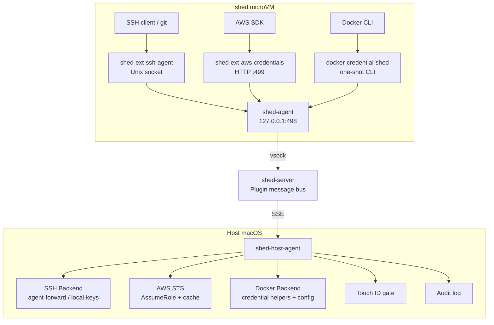
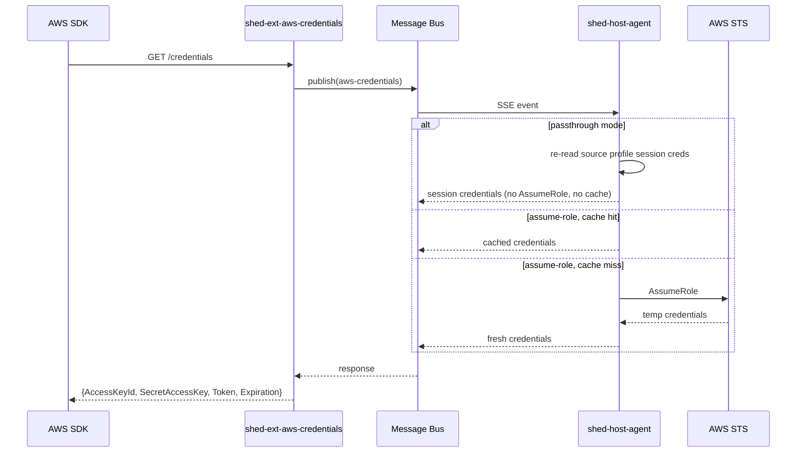
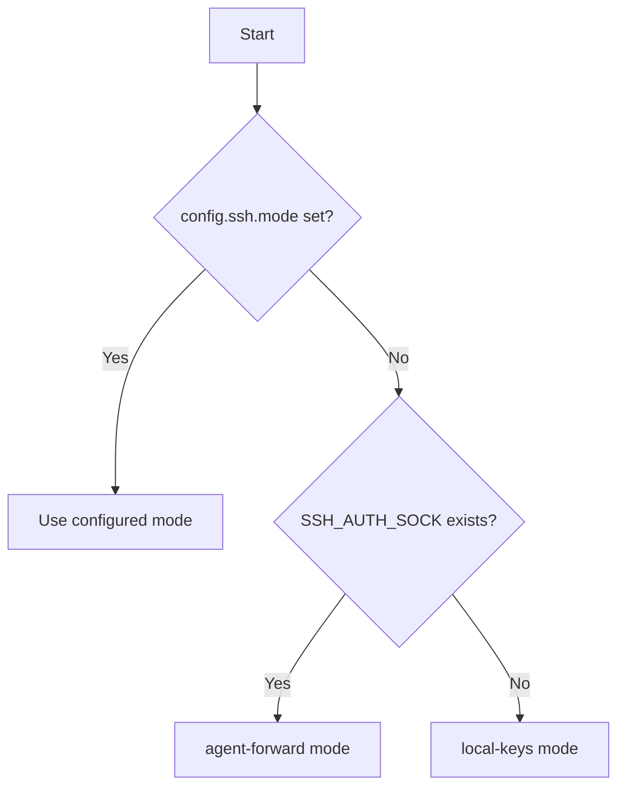

# Extensions Architecture

The credential extensions broker all signing and secret resolution through the
host machine over shed's [plugin message bus](../reference/extensions.md). This
page traces the component layout, the per-namespace message flows, and how the
guest binaries are built and shipped.

## Component Overview

## Message Flow

### SSH Sign Request

1. SSH client connects to `shed-ext-ssh-agent` via `SSH_AUTH_SOCK`
2. `shed-ext-ssh-agent` translates the SSH agent protocol `Sign()` call into a JSON envelope
3. Envelope is POSTed to `http://127.0.0.1:498/v1/publish` (shed-agent's HTTP endpoint)
4. shed-agent sends the message over vsock to shed-server
5. shed-server routes the message to the `ssh-agent` namespace listener via SSE
6. `shed-host-agent` receives the envelope, dispatches to the SSH backend
7. SSH backend performs the signing operation using host keys
8. Response envelope flows back: host-agent -> shed-server -> shed-agent -> shed-ext-ssh-agent
9. `shed-ext-ssh-agent` returns the signature to the SSH client

### AWS Credential Request

1. AWS SDK calls `GET http://127.0.0.1:499/credentials` (via `AWS_CONTAINER_CREDENTIALS_FULL_URI`)
2. `shed-ext-aws-credentials` translates the HTTP request into a JSON envelope
3. Envelope is POSTed to the shed-agent publish endpoint
4. shed-server routes the message to the `aws-credentials` namespace listener via SSE
5. `shed-host-agent` receives the envelope, checks its credential cache
6. If cached credentials are still valid (>5 min remaining), return immediately
7. If stale, call `sts:AssumeRole` with the configured role and cache the result — or, in passthrough mode, re-read and vend the source profile's session credentials directly (no AssumeRole, no caching)
8. Response flows back to `shed-ext-aws-credentials`, which returns the AWS SDK-expected format
9. The SDK caches the credential in memory and manages its own refresh

### Docker Credential Request

1. Docker CLI execs `docker-credential-shed get` with the registry hostname on stdin
2. `docker-credential-shed` translates the request into a JSON envelope and POSTs to the shed-agent publish endpoint
3. shed-server routes the message to the `docker-credentials` namespace listener via SSE
4. `shed-host-agent` checks the registry allowlist, reads `~/.docker/config.json`, and shells out to the appropriate credential helper (gcloud, osxkeychain, ecr-login, etc.)
5. Response flows back to `docker-credential-shed`, which writes credentials to stdout and exits

## Package Structure

All extension code lives in the shed monorepo. The guest binaries are Go and share the
`internal/ext/` packages and the `github.com/charliek/shed/sdk` module. The host binary,
`shed-host-agent`, is a separate Rust crate (`crates/shed-host-agent`, built on the
shared `crates/shed-broker` core) that ports the same wire protocol — it talks to
shed-server over the identical `sdk.HostClient`-shaped SSE subscribe/respond endpoints,
so guest and host still agree on the wire even though they no longer share Go source.

### Guest-Side

- **`internal/ext/sshagent/`** — Implements `golang.org/x/crypto/ssh/agent.Agent`. Each method marshals a request, POSTs to the publish endpoint, and unmarshals the response.
- **`internal/ext/awsproxy/`** — HTTP handler for the AWS container credential endpoint. Translates `GET /credentials` into message bus requests. Returns the PascalCase JSON format the AWS SDK expects.
- **`internal/ext/dockercred/`** — Docker credential helper bus client. Translates Docker credential helper protocol operations (`get`, `list`) into message bus requests. One-shot usage (not a daemon).
- **`cmd/shed-ext-ssh-agent/`** — Unix socket listener. Creates a new agent instance per connection. Handles startup health check and graceful shutdown.
- **`cmd/shed-ext-aws-credentials/`** — HTTP server on port 499. Routes `/credentials` to the proxy handler.
- **`cmd/docker-credential-shed/`** — One-shot CLI binary. Docker execs this binary per credential operation. Reads stdin, publishes to bus, writes stdout, exits.

### Host-Side

- **`crates/shed-host-agent/`** — the daemon shell (CLI, signals, socket bind, the
  desktop UDS server) over **`crates/shed-broker`**, the embeddable broker core: it
  subscribes to namespaces via a Rust port of the `sdk.HostClient` SSE
  subscribe/respond protocol (handles subscription, reconnection, and response
  delivery), dispatches requests to the SSH, AWS, and Docker handlers concurrently, and
  hosts the approval gates. The `biometrics`/`biometrics-or-password` policies use a
  native macOS Touch ID / LocalAuthentication gate built on `objc2` — it links the
  LocalAuthentication framework directly, so the binary needs no CGO on darwin (unlike
  the Go daemon it replaced). The `shed-desktop` policy instead delegates the approval
  decision to a connected desktop app over the UDS channel described below.

### Shared

- **`internal/ext/protocol/`** — Envelope and payload types. The JSON wire format matches shed's `internal/plugin` types.

## SSH Backend Selection

**Agent-forward**: Proxies to the developer's existing SSH agent (Secretive, 1Password, ssh-agent, yubikey-agent). Zero disruption to existing key management.

**Local-keys**: Reads keys directly from `~/.ssh/`. Fallback when no agent is running.

## AWS Credential Caching

The caching strategy is asymmetric:

- **Guest proxy**: Pure passthrough, no caching. Every SDK request goes to the bus.
- **Host handler (assume-role mode)**: Caches STS credentials per shed, keyed by server/shed.
- **Host handler (passthrough mode)**: No caching — the shared credentials file is re-read on every request so a fresh SSO/SAML login is picked up immediately.

This avoids cache coherence complexity. The bus round trip is sub-millisecond (vsock, same machine), and the SDK only fetches credentials when its in-memory cache is stale (~once per hour).

## Distribution

Extension artifacts ship from the shed release pipeline, split by where they run:

| Component | Channel | How it is built |
|-----------|---------|-----------------|
| `shed-host-agent` (darwin + linux) | GitHub Release (GoReleaser) + Homebrew tap (brew-only) | Built from `crates/shed-host-agent` on the macOS release runner; also hosts the machine RC hub (the retired `shed-machine-rc`'s brew/apt artifacts stay frozen at their last release) |
| Guest binaries + systemd units + env config | Baked into the `extensions` / `full` rootfs images | Cross-compiled from `cmd/` and staged into the image build context by `scripts/stage-guest-binaries.sh`, alongside the `guest/extensions/etc/` overlay |

The guest binaries (`shed-ext-ssh-agent`, `shed-ext-aws-credentials`,
`docker-credential-shed`, `shed-ext-rc`) are compiled in-tree — there is no
separate published image to `COPY --from`. The same `stage-guest-binaries.sh`
script feeds the local `scripts/build-{vz,firecracker}-rootfs.sh` flows and the
`publish-images.yaml` CI jobs, so a local dev build and a released image carry
byte-identical staging logic. See
[Testing](../development/testing.md) for the rootfs-rebuild loop.

## Security Boundaries

| Boundary | What crosses | What doesn't |
|----------|-------------|--------------|
| VM -> Host (SSH sign) | Challenge data, public key reference | Private keys |
| Host -> VM (SSH response) | Signature blob | Private keys |
| VM -> Host (AWS request) | Operation type only | Role ARN, source credentials |
| Host -> VM (AWS response) | Short-lived STS token (1h) | Long-lived AWS credentials |
| VM -> Host (Docker get) | Registry hostname | Docker config.json contents |
| Host -> VM (Docker response) | Registry credentials (tokens or passwords) | Host Docker config, other registries' credentials |
