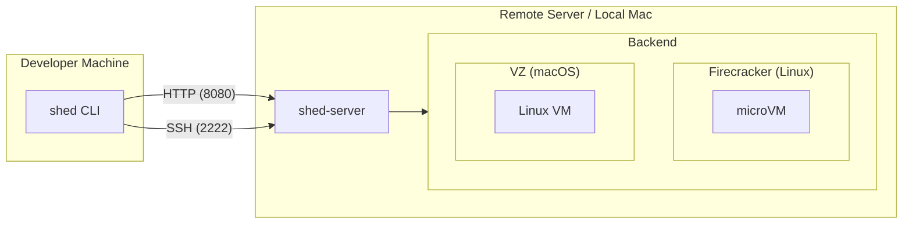

# Shed

Shed is a lightweight tool for managing persistent, VM-based development environments across multiple servers. It enables developers to spin up isolated coding sessions with AI tools (Claude Code, OpenCode) pre-installed, disconnect, and reconnect later to continue work.

## Features

- **Simple CLI** - Create and manage dev environments with minimal commands
- **Session Persistence** - VMs keep running after disconnect
- **Multi-Server** - Manage sheds across home servers and cloud VPS instances
- **IDE Integration** - Native Cursor/VS Code support via SSH Remote
- **AI-Ready** - Pre-configured for Claude Code and OpenCode workflows
- **VM Backends** - Firecracker microVMs (Linux) or Apple VZ virtual machines (macOS Apple Silicon)

## Architecture

Shed consists of two binaries:

- **`shed`** - CLI for developer machines (macOS, Linux)
- **`shed-server`** - Server daemon exposing HTTP API (port 8080) and SSH server (port 2222)

The server runs one backend based on the platform:

- **VZ** - Uses Apple Virtualization.framework VMs via vfkit (macOS Apple Silicon)
- **Firecracker** - Uses microVMs with vsock communication (Linux with KVM)

Set `default_backend: detect` to auto-select based on platform, or specify `vz` or `firecracker` explicitly.

## Requirements

| Component | Requirements |
|-----------|--------------|
| Client | macOS or Linux with Go 1.24+ |
| Server (VZ) | macOS 13+ (Ventura) on Apple Silicon (arm64) |
| Server (Firecracker) | Linux with KVM support |
| Network | Tailscale (or any private network) connecting all machines |

## Quick Links

- [Quick Start](getting-started/quick-start.md) - Get up and running
- [CLI Reference](reference/cli.md) - All commands and options
- [Configuration](reference/configuration.md) - Client and server config
- [VZ Setup](getting-started/vz-setup.md) - Set up VZ backend (macOS)
- [VZ Operations](reference/vz-operations.md) - Using VZ sheds
- [Firecracker Setup](getting-started/fc-setup.md) - Set up Firecracker backend
- [Firecracker Operations](reference/fc-operations.md) - Using Firecracker sheds
- [Roadmap](ROADMAP.md) - Future enhancements

## Security Model

Shed is designed for single-user scenarios where:

- All machines are connected via Tailscale (or similar private network)
- The developer owns/controls all machines
- Network access implies trust

**Not suitable for:** Multi-tenant environments, public internet exposure, or untrusted network access.
