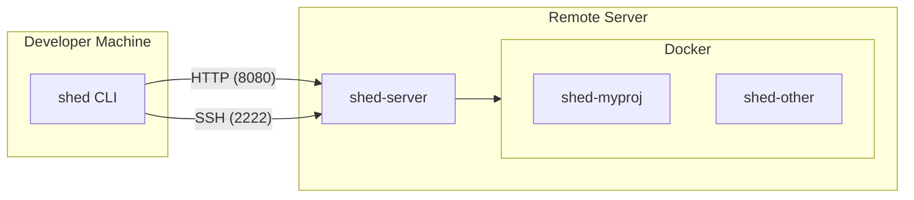

# Shed

Shed is a lightweight tool for managing persistent, containerized development environments across multiple servers. It enables developers to spin up isolated coding sessions with AI tools (Claude Code, OpenCode) pre-installed, disconnect, and reconnect later to continue work.

## Features

- **Simple CLI** - Create and manage dev environments with minimal commands
- **Session Persistence** - Containers keep running after disconnect
- **Multi-Server** - Manage sheds across home servers and cloud VPS instances
- **IDE Integration** - Native Cursor/VS Code support via SSH Remote
- **AI-Ready** - Pre-configured for Claude Code and OpenCode workflows

## Architecture

Shed consists of two binaries:

- **`shed`** - CLI for developer machines (macOS, Linux)
- **`shed-server`** - Server daemon exposing HTTP API (port 8080) and SSH server (port 2222)

## Requirements

| Component | Requirements |
|-----------|--------------|
| Client | macOS or Linux with Go 1.24+ |
| Server | Linux with Docker installed |
| Network | Tailscale (or any private network) connecting all machines |

## Quick Links

- [Quick Start](getting-started/quick-start.md) - Get up and running
- [CLI Reference](reference/cli.md) - All commands and options
- [Configuration](reference/configuration.md) - Client and server config
- [Server Setup](getting-started/server-setup.md) - Install shed-server

## Security Model

Shed is designed for single-user scenarios where:

- All machines are connected via Tailscale (or similar private network)
- The developer owns/controls all machines
- Network access implies trust

**Not suitable for:** Multi-tenant environments, public internet exposure, or untrusted network access.
