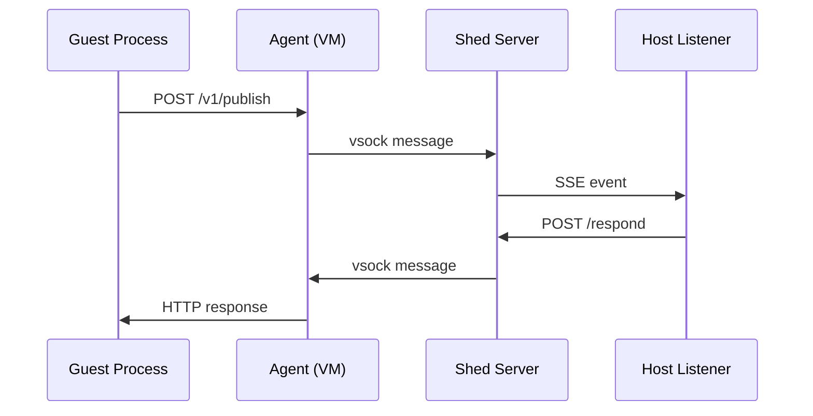

# Extensions

Shed provides a namespaced message bus for communication between processes inside VMs and external processes on the host. This enables building plugins that extend shed's functionality without modifying shed itself.

## Overview

The extension system works by routing messages between guest and host:

1. A process inside the VM publishes a message to a **namespace** (e.g., `op` for 1Password)
2. The shed agent forwards it over vsock to the shed server
3. The server delivers it to a registered **host-side listener** via SSE
4. The listener processes the request and sends a response back



## Message Envelope

All messages use a common JSON envelope:

```json
{
  "id": "019abc12-3456-7def-8901-234567890abc",
  "namespace": "op",
  "type": "request",
  "in_reply_to": "",
  "final": true,
  "timestamp": "2026-03-29T12:00:00Z",
  "payload": {},
  "shed": {
    "name": "my-dev",
    "backend": "vz",
    "server": "mini"
  }
}
```

| Field | Type | Description |
|-------|------|-------------|
| `id` | string | UUIDv7 identifier, unique per message |
| `namespace` | string | Routing key (e.g., `op`, `proxy`). `system:*` is reserved. |
| `type` | string | `request`, `response`, or `event` |
| `in_reply_to` | string | For responses: the `id` of the original request |
| `final` | boolean | Whether this is the last response for a request |
| `timestamp` | string | RFC 3339 timestamp |
| `payload` | object | Namespace-specific data (opaque to shed) |
| `shed` | object | Shed metadata, added by the server |

## Publishing from Inside a VM

The shed agent runs an HTTP API on `127.0.0.1:498` inside every VZ and Firecracker VM.

### Send a request (wait for response)

```bash
curl -s http://127.0.0.1:498/v1/publish -d '{
  "namespace": "op",
  "payload": {"action": "read", "item": "github-token"}
}'
```

The agent blocks until the host listener responds (30s timeout). The response envelope is returned as the HTTP body.

### Send an event (fire-and-forget)

```bash
curl -s http://127.0.0.1:498/v1/publish -d '{
  "namespace": "proxy",
  "type": "event",
  "payload": {"action": "register", "port": 8080}
}'
```

Returns `202 Accepted` immediately.

### Error responses

| Status | Code | Meaning |
|--------|------|---------|
| 400 | `INVALID_BODY` | Malformed JSON |
| 400 | `MISSING_NAMESPACE` | Namespace field is empty |
| 503 | `NO_CONNECTION` | Agent has no active vsock connection to host |
| 504 | `TIMEOUT` | Host listener did not respond within 30s |

## Building a Host-Side Listener

A host-side listener subscribes to a namespace via SSE and receives messages from all running sheds.

### Subscribe to a namespace

```bash
curl -N -H "Accept: text/event-stream" \
  http://localhost:8080/api/plugins/listeners/op/messages
```

Messages arrive as SSE events:

```text
event: message
data: {"id":"...","namespace":"op","type":"request","payload":{...},"shed":{"name":"my-dev","backend":"vz","server":"mini"}}
```

### Send a response

When you receive a request, respond by POSTing back to the server. Include the shed name for routing:

```bash
curl -X POST http://localhost:8080/api/plugins/listeners/op/respond \
  -H "Content-Type: application/json" \
  -d '{
    "namespace": "op",
    "type": "response",
    "in_reply_to": "019abc12-...",
    "final": true,
    "shed": {"name": "my-dev"},
    "payload": {"token": "ghp_..."}
  }'
```

### Go client example

```go
package main

import (
    "bufio"
    "encoding/json"
    "fmt"
    "net/http"
    "strings"
)

func main() {
    req, _ := http.NewRequest("GET",
        "http://localhost:8080/api/plugins/listeners/op/messages", nil)
    req.Header.Set("Accept", "text/event-stream")

    resp, err := http.DefaultClient.Do(req)
    if err != nil {
        panic(err)
    }
    defer resp.Body.Close()

    scanner := bufio.NewScanner(resp.Body)
    for scanner.Scan() {
        line := scanner.Text()
        if strings.HasPrefix(line, "data: ") {
            data := strings.TrimPrefix(line, "data: ")
            var env map[string]any
            json.Unmarshal([]byte(data), &env)
            fmt.Printf("Message from shed %s: %v\n",
                env["shed"].(map[string]any)["name"], env["payload"])
        }
    }
}
```

## Server API Reference

All endpoints are under the shed server's HTTP API (default port 8080).

### List active listeners

```
GET /api/plugins/listeners
```

```json
{
  "listeners": [
    {"namespace": "op", "created_at": "2026-03-29T12:00:00Z"}
  ]
}
```

### Subscribe to namespace (SSE)

```
GET /api/plugins/listeners/{namespace}/messages
```

Registers as the listener for the namespace and streams messages as SSE events. Only one listener per namespace is allowed.

| Status | Code | Meaning |
|--------|------|---------|
| 403 | `NAMESPACE_RESERVED` | `system:*` namespaces cannot be registered |
| 409 | `NAMESPACE_ALREADY_REGISTERED` | Another listener is already subscribed |

### Respond to a message

```
POST /api/plugins/listeners/{namespace}/respond
```

Sends a response envelope back to the originating shed. The envelope body must include `shed.name` to route the response.

| Status | Code | Meaning |
|--------|------|---------|
| 204 | | Response delivered |
| 400 | `MISSING_SHED` | Envelope missing `shed.name` |
| 404 | `SHED_NOT_CONNECTED` | Target shed has no active message channel |

### List connected sheds

```
GET /api/plugins/sheds
```

```json
{
  "sheds": [
    {"name": "my-dev", "backend": "vz", "server": "mini"}
  ]
}
```

## Extension Management

Extensions can be selectively enabled via server configuration. The agent reads extension manifests from the VM image and activates only the configured ones.

### Server Configuration

```yaml
extensions:
  enabled:
    - ssh-agent
    - aws-credentials
```

When `extensions` is omitted from the config, no extensions are activated.

### Extension Manifests

Each extension provides a manifest file in `/etc/shed-extensions.d/`:

```yaml
# /etc/shed-extensions.d/ssh-agent.yaml
namespace: ssh-agent
systemd_unit: shed-ext-ssh-agent.service
description: SSH agent forwarding via shed message bus
```

| Field | Required | Description |
|-------|----------|-------------|
| `namespace` | Yes | Plugin namespace (must match server config) |
| `systemd_unit` | Yes | Systemd unit to enable |
| `description` | No | Human-readable description |

### Activation Flow

1. Server sends the enabled extensions list in the health handshake
2. Agent reads manifests from `/etc/shed-extensions.d/`
3. Agent runs `systemctl enable --now` for each enabled extension
4. Extensions not in the enabled list remain inactive

Extensions are **enable-only** — they persist until VM restart. Runtime disabling is not supported.

### Extension Health

The agent periodically checks each enabled extension at two levels:

- **guest**: Is the systemd service running? (`systemctl is-active`)
- **host**: Can the extension reach the host agent end-to-end? (bus ping round-trip)

Health status is included in heartbeats and visible via `shed list -vv`:

```text
Extensions:
  aws-credentials:     guest=running  host=connected
  ssh-agent:           guest=running  host=connected
```

### Naming Convention

| Component | Pattern | Example |
|-----------|---------|---------|
| Guest binary | `shed-ext-<namespace>` | `shed-ext-ssh-agent` |
| Systemd unit | `shed-ext-<namespace>.service` | `shed-ext-ssh-agent.service` |
| Manifest | `<namespace>.yaml` | `ssh-agent.yaml` |
| Host binary | `shed-ext-<purpose>-host` | `shed-ext-credentials-host` |

### SDK

The `github.com/charliek/shed/sdk` Go module provides shared types and clients for building extensions:

- `sdk.Envelope` — Universal message format
- `sdk.BusClient` — Guest-side HTTP publisher to shed-agent
- `sdk.HostClient` — Host-side SSE subscriber to shed-server

```go
import "github.com/charliek/shed/sdk"

// Guest-side: publish a request
bus := sdk.NewBusClient(sdk.DefaultPublishURL, sdk.DefaultBusTimeout)
resp, err := bus.Publish(ctx, "my-namespace", payload)

// Host-side: subscribe to messages
host := sdk.NewHostClient(sdk.WithServerURL("http://localhost:8080"))
ch := host.Subscribe(ctx, "my-namespace")
for env := range ch {
    // handle message, send response
    host.Respond(ctx, "my-namespace", responseEnv)
}
```

## shed-extensions

The `experimental` image variant comes with [shed-extensions](https://charliek.github.io/shed-extensions/) pre-installed, providing SSH agent forwarding and AWS credential proxying. Create a shed with `--image experimental`, enable extensions in your server config, and run the host agent to enable credential brokering.

shed-extensions is a concrete implementation built on this plugin bus. See the [shed-extensions documentation](https://charliek.github.io/shed-extensions/) for credential brokering setup and usage.

## Use Cases

### 1Password CLI proxy

Run `op` commands from inside a VM using host credentials:

1. Host runs a listener subscribed to `op` namespace
2. VM has an `op` shim that publishes requests to `op` namespace
3. Host listener runs the real `op` CLI and returns the result

### Dynamic proxy registration

A reverse proxy on the host listens to a `proxy` namespace. Sheds send `event` messages to register routes:

```json
{
  "namespace": "proxy",
  "type": "event",
  "payload": {"action": "register", "hostname": "myapp.dev", "port": 8080}
}
```

The proxy updates its routing table based on shed metadata.

### Activity monitoring

A monitoring process subscribes to a `monitor` namespace. Sheds publish activity events, and the monitor triggers notifications (desktop alerts, Slack messages) based on configurable rules.

## Reserved Namespaces

Namespaces prefixed with `system:` are reserved for shed internal use and cannot be registered by external listeners. Currently used:

| Namespace | Purpose |
|-----------|---------|
| `system:health` | Agent health checks during VM startup |

## Limitations

- One listener per namespace (additional registrations are rejected)
- Guest-side subscribe (receiving host-initiated messages) is not yet supported
- The agent HTTP endpoint uses plain HTTP (HTTPS support planned)
